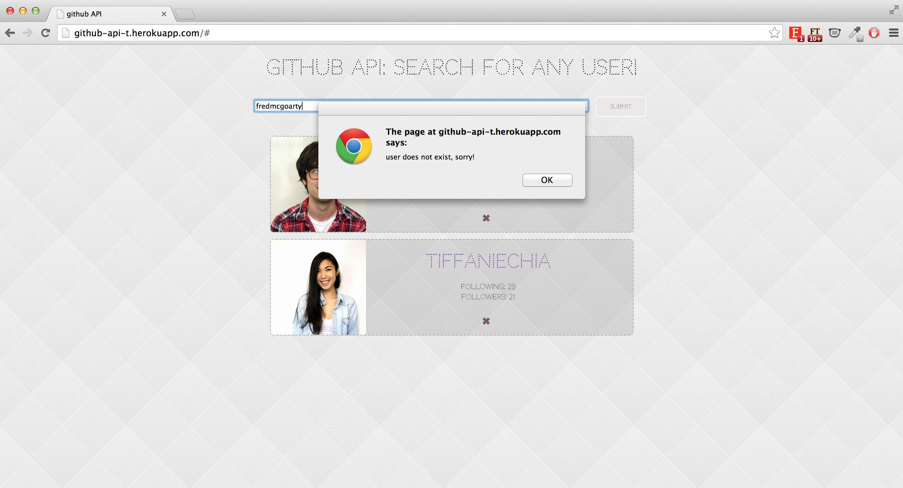

##GitHub API Task

The goal of this task was to understand the use of JSON, and mustache.js in the context of web development.
The app aims to pull information on a particular user's GitHub account - in this case the number of followers and following the user has.

The app is capable of showing error messages if the input is not a valid user name. And it is possible to remove generated information on the app.

This task was set by [Alex Peattie](https://github.com/alexpeattie).

(Week 8)

##The app is available [here](http://github-api-t.herokuapp.com/). 

#### Search results from GitHub API

#### Error message from incorrect input

##Technologies Used
- Ruby
- Sintara
- Javascript
- JQuery
- JSON
- Moustache.js
- GitHub API

##Collaborators

- [Mark Mekhaiel](https://github.com/markmekhaiel)
- [Fred Mcgroarty](https://github.com/fredmcgroarty)
- [Andrew Cumine](https://github.com/ajcumine)
- [Tiffanie Chia](https://github.com/tiffaniechia)
